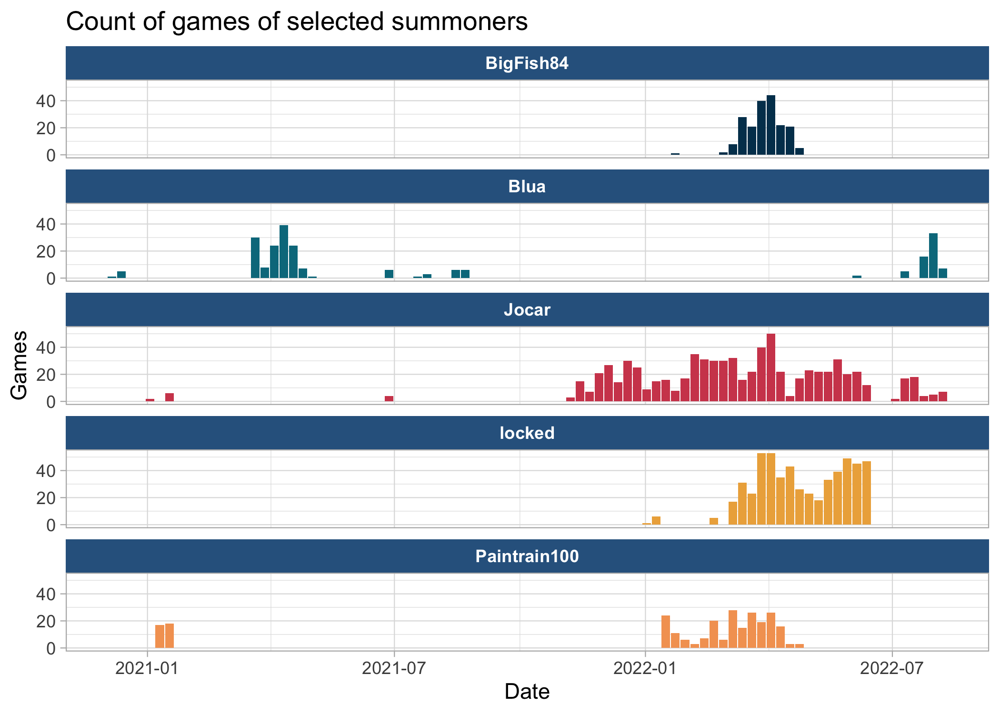
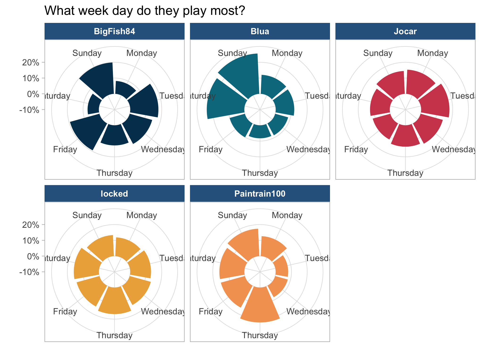
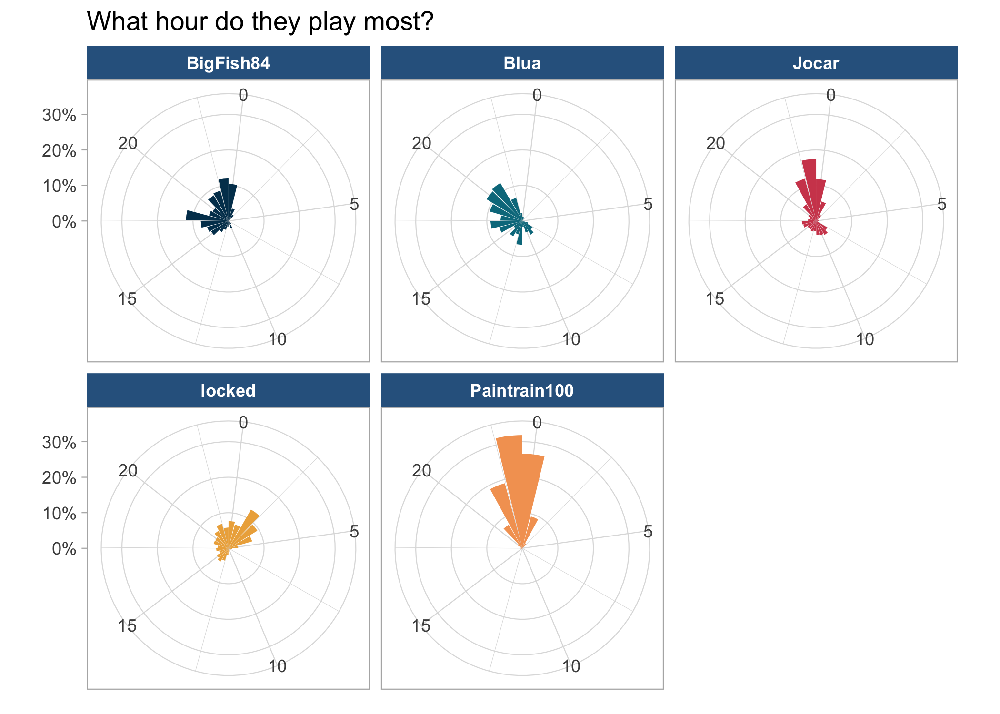
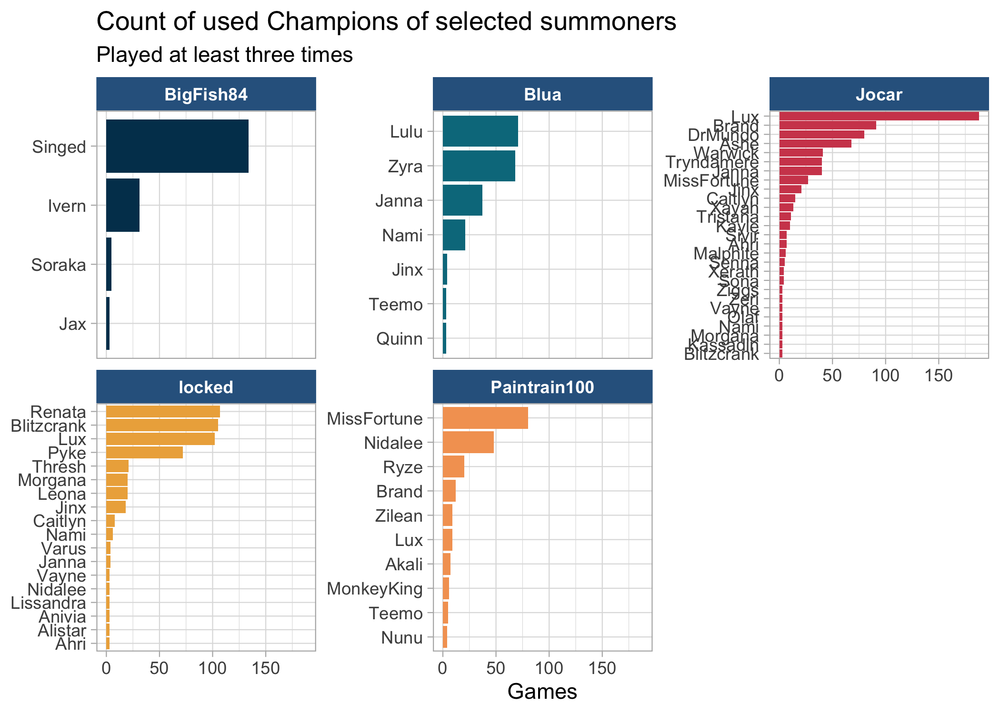
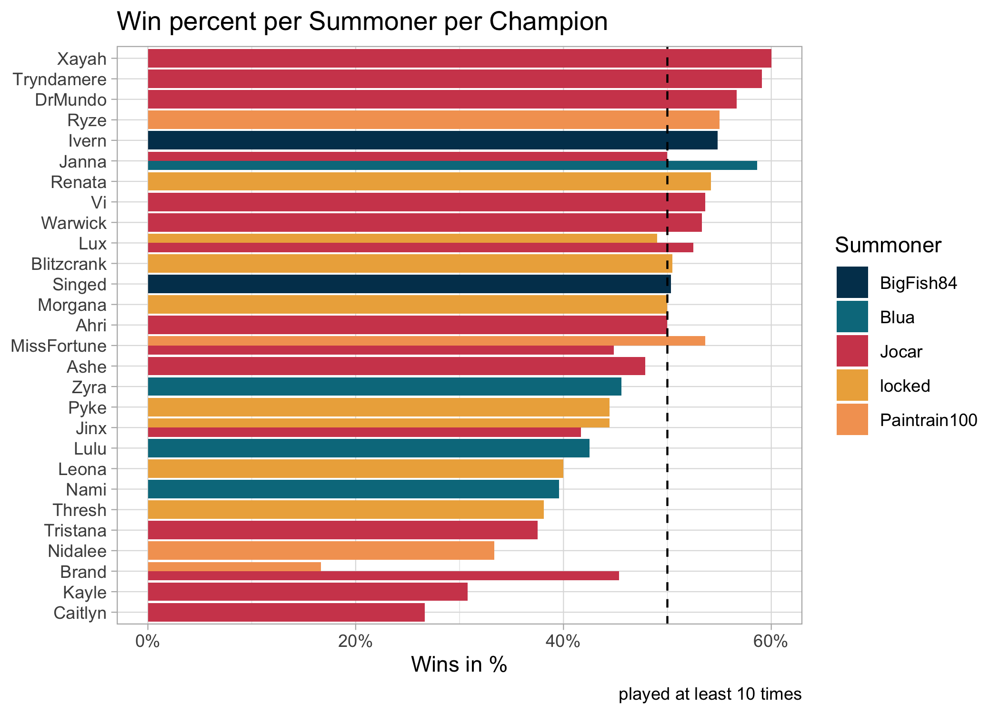
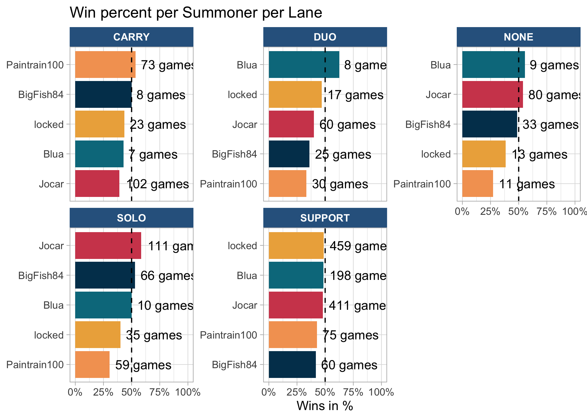
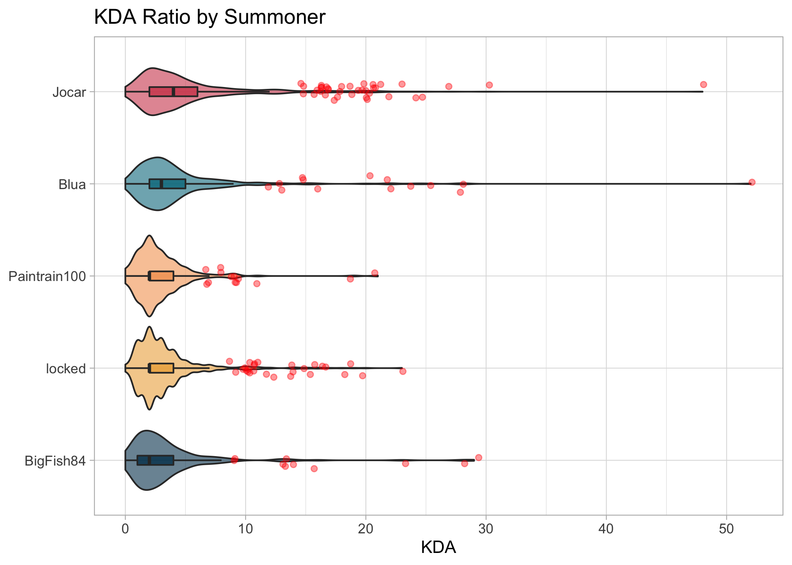
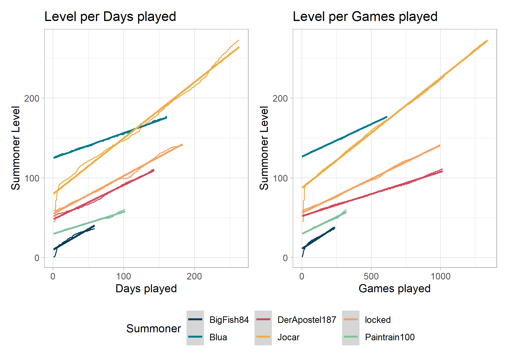

<!-- README.md is generated from README.Rmd. Please edit that file -->

# LOL Exploration

<!-- badges: start -->
<!-- badges: end -->

The goal of LOL Exploration is to …

<!-- --><!-- --><!-- --><!-- --><!-- --><!-- --><!-- -->
<table>
<caption>
Last 5 games per Summoner
</caption>
<thead>
<tr>
<th style="text-align:left;">
mode
</th>
<th style="text-align:left;">
time
</th>
<th style="text-align:left;">
summoner
</th>
<th style="text-align:left;">
champion
</th>
<th style="text-align:left;">
win
</th>
<th style="text-align:right;">
kills
</th>
<th style="text-align:right;">
assists
</th>
<th style="text-align:right;">
deaths
</th>
<th style="text-align:right;">
kda
</th>
</tr>
</thead>
<tbody>
<tr grouplength="5">
<td colspan="9" style="border-bottom: 1px solid;">
<strong>BigFish84</strong>
</td>
</tr>
<tr>
<td style="text-align:left;padding-left: 2em;" indentlevel="1">
ARAM
</td>
<td style="text-align:left;">
2022-09-09 00:24:24
</td>
<td style="text-align:left;">
BigFish84
</td>
<td style="text-align:left;">
Singed
</td>
<td style="text-align:left;">
TRUE
</td>
<td style="text-align:right;">
5
</td>
<td style="text-align:right;">
15
</td>
<td style="text-align:right;">
10
</td>
<td style="text-align:right;">
2.0
</td>
</tr>
<tr>
<td style="text-align:left;padding-left: 2em;" indentlevel="1">
ARAM
</td>
<td style="text-align:left;">
2022-09-09 00:05:29
</td>
<td style="text-align:left;">
BigFish84
</td>
<td style="text-align:left;">
Nautilus
</td>
<td style="text-align:left;">
FALSE
</td>
<td style="text-align:right;">
2
</td>
<td style="text-align:right;">
14
</td>
<td style="text-align:right;">
10
</td>
<td style="text-align:right;">
1.6
</td>
</tr>
<tr>
<td style="text-align:left;padding-left: 2em;" indentlevel="1">
CLASSIC
</td>
<td style="text-align:left;">
2022-09-08 23:21:32
</td>
<td style="text-align:left;">
BigFish84
</td>
<td style="text-align:left;">
Singed
</td>
<td style="text-align:left;">
TRUE
</td>
<td style="text-align:right;">
0
</td>
<td style="text-align:right;">
17
</td>
<td style="text-align:right;">
7
</td>
<td style="text-align:right;">
2.4
</td>
</tr>
<tr>
<td style="text-align:left;padding-left: 2em;" indentlevel="1">
CLASSIC
</td>
<td style="text-align:left;">
2022-09-08 22:52:35
</td>
<td style="text-align:left;">
BigFish84
</td>
<td style="text-align:left;">
Singed
</td>
<td style="text-align:left;">
TRUE
</td>
<td style="text-align:right;">
3
</td>
<td style="text-align:right;">
3
</td>
<td style="text-align:right;">
0
</td>
<td style="text-align:right;">
6.0
</td>
</tr>
<tr>
<td style="text-align:left;padding-left: 2em;" indentlevel="1">
CLASSIC
</td>
<td style="text-align:left;">
2022-04-28 00:02:59
</td>
<td style="text-align:left;">
BigFish84
</td>
<td style="text-align:left;">
Singed
</td>
<td style="text-align:left;">
TRUE
</td>
<td style="text-align:right;">
1
</td>
<td style="text-align:right;">
12
</td>
<td style="text-align:right;">
12
</td>
<td style="text-align:right;">
1.1
</td>
</tr>
<tr grouplength="5">
<td colspan="9" style="border-bottom: 1px solid;">
<strong>Blua</strong>
</td>
</tr>
<tr>
<td style="text-align:left;padding-left: 2em;" indentlevel="1">
CLASSIC
</td>
<td style="text-align:left;">
2022-09-29 19:43:26
</td>
<td style="text-align:left;">
Blua
</td>
<td style="text-align:left;">
Janna
</td>
<td style="text-align:left;">
FALSE
</td>
<td style="text-align:right;">
0
</td>
<td style="text-align:right;">
1
</td>
<td style="text-align:right;">
4
</td>
<td style="text-align:right;">
0.2
</td>
</tr>
<tr>
<td style="text-align:left;padding-left: 2em;" indentlevel="1">
CLASSIC
</td>
<td style="text-align:left;">
2022-09-25 18:41:26
</td>
<td style="text-align:left;">
Blua
</td>
<td style="text-align:left;">
Janna
</td>
<td style="text-align:left;">
FALSE
</td>
<td style="text-align:right;">
2
</td>
<td style="text-align:right;">
20
</td>
<td style="text-align:right;">
6
</td>
<td style="text-align:right;">
3.7
</td>
</tr>
<tr>
<td style="text-align:left;padding-left: 2em;" indentlevel="1">
CLASSIC
</td>
<td style="text-align:left;">
2022-09-24 20:01:35
</td>
<td style="text-align:left;">
Blua
</td>
<td style="text-align:left;">
Nami
</td>
<td style="text-align:left;">
TRUE
</td>
<td style="text-align:right;">
5
</td>
<td style="text-align:right;">
30
</td>
<td style="text-align:right;">
4
</td>
<td style="text-align:right;">
8.8
</td>
</tr>
<tr>
<td style="text-align:left;padding-left: 2em;" indentlevel="1">
CLASSIC
</td>
<td style="text-align:left;">
2022-09-24 19:22:20
</td>
<td style="text-align:left;">
Blua
</td>
<td style="text-align:left;">
Janna
</td>
<td style="text-align:left;">
FALSE
</td>
<td style="text-align:right;">
0
</td>
<td style="text-align:right;">
15
</td>
<td style="text-align:right;">
3
</td>
<td style="text-align:right;">
5.0
</td>
</tr>
<tr>
<td style="text-align:left;padding-left: 2em;" indentlevel="1">
CLASSIC
</td>
<td style="text-align:left;">
2022-09-23 21:53:52
</td>
<td style="text-align:left;">
Blua
</td>
<td style="text-align:left;">
Sivir
</td>
<td style="text-align:left;">
FALSE
</td>
<td style="text-align:right;">
14
</td>
<td style="text-align:right;">
5
</td>
<td style="text-align:right;">
13
</td>
<td style="text-align:right;">
1.5
</td>
</tr>
<tr grouplength="5">
<td colspan="9" style="border-bottom: 1px solid;">
<strong>Jocar</strong>
</td>
</tr>
<tr>
<td style="text-align:left;padding-left: 2em;" indentlevel="1">
ARAM
</td>
<td style="text-align:left;">
2022-10-04 03:14:05
</td>
<td style="text-align:left;">
Jocar
</td>
<td style="text-align:left;">
Irelia
</td>
<td style="text-align:left;">
TRUE
</td>
<td style="text-align:right;">
13
</td>
<td style="text-align:right;">
17
</td>
<td style="text-align:right;">
6
</td>
<td style="text-align:right;">
5.0
</td>
</tr>
<tr>
<td style="text-align:left;padding-left: 2em;" indentlevel="1">
ARAM
</td>
<td style="text-align:left;">
2022-10-04 02:51:00
</td>
<td style="text-align:left;">
Jocar
</td>
<td style="text-align:left;">
Katarina
</td>
<td style="text-align:left;">
TRUE
</td>
<td style="text-align:right;">
7
</td>
<td style="text-align:right;">
27
</td>
<td style="text-align:right;">
5
</td>
<td style="text-align:right;">
6.8
</td>
</tr>
<tr>
<td style="text-align:left;padding-left: 2em;" indentlevel="1">
ARAM
</td>
<td style="text-align:left;">
2022-10-04 02:23:28
</td>
<td style="text-align:left;">
Jocar
</td>
<td style="text-align:left;">
Tryndamere
</td>
<td style="text-align:left;">
TRUE
</td>
<td style="text-align:right;">
10
</td>
<td style="text-align:right;">
16
</td>
<td style="text-align:right;">
11
</td>
<td style="text-align:right;">
2.4
</td>
</tr>
<tr>
<td style="text-align:left;padding-left: 2em;" indentlevel="1">
ARAM
</td>
<td style="text-align:left;">
2022-10-04 01:50:42
</td>
<td style="text-align:left;">
Jocar
</td>
<td style="text-align:left;">
Xerath
</td>
<td style="text-align:left;">
FALSE
</td>
<td style="text-align:right;">
19
</td>
<td style="text-align:right;">
31
</td>
<td style="text-align:right;">
9
</td>
<td style="text-align:right;">
5.6
</td>
</tr>
<tr>
<td style="text-align:left;padding-left: 2em;" indentlevel="1">
ARAM
</td>
<td style="text-align:left;">
2022-10-04 01:24:04
</td>
<td style="text-align:left;">
Jocar
</td>
<td style="text-align:left;">
Jinx
</td>
<td style="text-align:left;">
TRUE
</td>
<td style="text-align:right;">
17
</td>
<td style="text-align:right;">
16
</td>
<td style="text-align:right;">
6
</td>
<td style="text-align:right;">
5.5
</td>
</tr>
<tr grouplength="5">
<td colspan="9" style="border-bottom: 1px solid;">
<strong>locked</strong>
</td>
</tr>
<tr>
<td style="text-align:left;padding-left: 2em;" indentlevel="1">
CLASSIC
</td>
<td style="text-align:left;">
2022-06-18 02:50:11
</td>
<td style="text-align:left;">
locked
</td>
<td style="text-align:left;">
Renata
</td>
<td style="text-align:left;">
TRUE
</td>
<td style="text-align:right;">
1
</td>
<td style="text-align:right;">
22
</td>
<td style="text-align:right;">
3
</td>
<td style="text-align:right;">
7.7
</td>
</tr>
<tr>
<td style="text-align:left;padding-left: 2em;" indentlevel="1">
CLASSIC
</td>
<td style="text-align:left;">
2022-06-17 16:01:50
</td>
<td style="text-align:left;">
locked
</td>
<td style="text-align:left;">
Renata
</td>
<td style="text-align:left;">
FALSE
</td>
<td style="text-align:right;">
1
</td>
<td style="text-align:right;">
19
</td>
<td style="text-align:right;">
10
</td>
<td style="text-align:right;">
2.0
</td>
</tr>
<tr>
<td style="text-align:left;padding-left: 2em;" indentlevel="1">
CLASSIC
</td>
<td style="text-align:left;">
2022-06-17 01:47:07
</td>
<td style="text-align:left;">
locked
</td>
<td style="text-align:left;">
Renata
</td>
<td style="text-align:left;">
TRUE
</td>
<td style="text-align:right;">
2
</td>
<td style="text-align:right;">
12
</td>
<td style="text-align:right;">
3
</td>
<td style="text-align:right;">
4.7
</td>
</tr>
<tr>
<td style="text-align:left;padding-left: 2em;" indentlevel="1">
CLASSIC
</td>
<td style="text-align:left;">
2022-06-17 01:06:49
</td>
<td style="text-align:left;">
locked
</td>
<td style="text-align:left;">
Renata
</td>
<td style="text-align:left;">
TRUE
</td>
<td style="text-align:right;">
0
</td>
<td style="text-align:right;">
20
</td>
<td style="text-align:right;">
5
</td>
<td style="text-align:right;">
4.0
</td>
</tr>
<tr>
<td style="text-align:left;padding-left: 2em;" indentlevel="1">
ARAM
</td>
<td style="text-align:left;">
2022-06-16 23:59:36
</td>
<td style="text-align:left;">
locked
</td>
<td style="text-align:left;">
Tristana
</td>
<td style="text-align:left;">
TRUE
</td>
<td style="text-align:right;">
16
</td>
<td style="text-align:right;">
17
</td>
<td style="text-align:right;">
6
</td>
<td style="text-align:right;">
5.5
</td>
</tr>
<tr grouplength="5">
<td colspan="9" style="border-bottom: 1px solid;">
<strong>Paintrain100</strong>
</td>
</tr>
<tr>
<td style="text-align:left;padding-left: 2em;" indentlevel="1">
ARAM
</td>
<td style="text-align:left;">
2022-09-09 00:24:24
</td>
<td style="text-align:left;">
Paintrain100
</td>
<td style="text-align:left;">
MonkeyKing
</td>
<td style="text-align:left;">
TRUE
</td>
<td style="text-align:right;">
6
</td>
<td style="text-align:right;">
8
</td>
<td style="text-align:right;">
8
</td>
<td style="text-align:right;">
1.8
</td>
</tr>
<tr>
<td style="text-align:left;padding-left: 2em;" indentlevel="1">
ARAM
</td>
<td style="text-align:left;">
2022-09-09 00:05:29
</td>
<td style="text-align:left;">
Paintrain100
</td>
<td style="text-align:left;">
Amumu
</td>
<td style="text-align:left;">
FALSE
</td>
<td style="text-align:right;">
4
</td>
<td style="text-align:right;">
13
</td>
<td style="text-align:right;">
9
</td>
<td style="text-align:right;">
1.9
</td>
</tr>
<tr>
<td style="text-align:left;padding-left: 2em;" indentlevel="1">
CLASSIC
</td>
<td style="text-align:left;">
2022-09-08 23:21:32
</td>
<td style="text-align:left;">
Paintrain100
</td>
<td style="text-align:left;">
MissFortune
</td>
<td style="text-align:left;">
TRUE
</td>
<td style="text-align:right;">
4
</td>
<td style="text-align:right;">
0
</td>
<td style="text-align:right;">
2
</td>
<td style="text-align:right;">
2.0
</td>
</tr>
<tr>
<td style="text-align:left;padding-left: 2em;" indentlevel="1">
CLASSIC
</td>
<td style="text-align:left;">
2022-09-08 22:52:35
</td>
<td style="text-align:left;">
Paintrain100
</td>
<td style="text-align:left;">
MissFortune
</td>
<td style="text-align:left;">
TRUE
</td>
<td style="text-align:right;">
4
</td>
<td style="text-align:right;">
5
</td>
<td style="text-align:right;">
0
</td>
<td style="text-align:right;">
9.0
</td>
</tr>
<tr>
<td style="text-align:left;padding-left: 2em;" indentlevel="1">
ARAM
</td>
<td style="text-align:left;">
2022-09-08 22:05:21
</td>
<td style="text-align:left;">
Paintrain100
</td>
<td style="text-align:left;">
Tristana
</td>
<td style="text-align:left;">
FALSE
</td>
<td style="text-align:right;">
8
</td>
<td style="text-align:right;">
11
</td>
<td style="text-align:right;">
11
</td>
<td style="text-align:right;">
1.7
</td>
</tr>
</tbody>
</table>

<!-- -->

## Time played

<table>
<caption>
Time play per queue ID
</caption>
<thead>
<tr>
<th style="text-align:left;">
description
</th>
<th style="text-align:right;">
BigFish84
</th>
<th style="text-align:right;">
Blua
</th>
<th style="text-align:right;">
Jocar
</th>
<th style="text-align:right;">
locked
</th>
<th style="text-align:right;">
Paintrain100
</th>
</tr>
</thead>
<tbody>
<tr>
<td style="text-align:left;">
5v5 ARAM games
</td>
<td style="text-align:right;">
4H 55M 54S
</td>
<td style="text-align:right;">
41M 38S
</td>
<td style="text-align:right;">
2d 13H 41M 17S
</td>
<td style="text-align:right;">
14H 2M 50S
</td>
<td style="text-align:right;">
20H 31M 9S
</td>
</tr>
<tr>
<td style="text-align:left;">
5v5 Blind Pick games
</td>
<td style="text-align:right;">
3d 5H 54M 13S
</td>
<td style="text-align:right;">
58M 51S
</td>
<td style="text-align:right;">
8d 14H 15M 50S
</td>
<td style="text-align:right;">
1H 47M 24S
</td>
<td style="text-align:right;">
2d 20H 26M 37S
</td>
</tr>
<tr>
<td style="text-align:left;">
5v5 Draft Pick games
</td>
<td style="text-align:right;">
1H 24M 59S
</td>
<td style="text-align:right;">
28M 37S
</td>
<td style="text-align:right;">
17H 30M 32S
</td>
<td style="text-align:right;">
8H 19M 34S
</td>
<td style="text-align:right;">
1H 24M 59S
</td>
</tr>
<tr>
<td style="text-align:left;">
5v5 Ranked Flex games
</td>
<td style="text-align:right;">
46M 5S
</td>
<td style="text-align:right;">
0S
</td>
<td style="text-align:right;">
46M 5S
</td>
<td style="text-align:right;">
0S
</td>
<td style="text-align:right;">
46M 5S
</td>
</tr>
<tr>
<td style="text-align:left;">
5v5 Ranked Solo games
</td>
<td style="text-align:right;">
0S
</td>
<td style="text-align:right;">
3d 13H 54M 0S
</td>
<td style="text-align:right;">
6d 4H 8M 20S
</td>
<td style="text-align:right;">
9d 8H 20M 7S
</td>
<td style="text-align:right;">
5H 44M 50S
</td>
</tr>
<tr>
<td style="text-align:left;">
ARURF games
</td>
<td style="text-align:right;">
0S
</td>
<td style="text-align:right;">
0S
</td>
<td style="text-align:right;">
30M 39S
</td>
<td style="text-align:right;">
9H 15M 15S
</td>
<td style="text-align:right;">
0S
</td>
</tr>
<tr>
<td style="text-align:left;">
Co-op vs. AI Beginner Bot games
</td>
<td style="text-align:right;">
34M 37S
</td>
<td style="text-align:right;">
59M 28S
</td>
<td style="text-align:right;">
0S
</td>
<td style="text-align:right;">
0S
</td>
<td style="text-align:right;">
0S
</td>
</tr>
<tr>
<td style="text-align:left;">
Co-op vs. AI Intermediate Bot games
</td>
<td style="text-align:right;">
45M 18S
</td>
<td style="text-align:right;">
0S
</td>
<td style="text-align:right;">
45M 18S
</td>
<td style="text-align:right;">
0S
</td>
<td style="text-align:right;">
45M 18S
</td>
</tr>
<tr>
<td style="text-align:left;">
One for All games
</td>
<td style="text-align:right;">
1H 26M 28S
</td>
<td style="text-align:right;">
0S
</td>
<td style="text-align:right;">
2H 46M 42S
</td>
<td style="text-align:right;">
44M 12S
</td>
<td style="text-align:right;">
43M 33S
</td>
</tr>
<tr>
<td style="text-align:left;">
Tutorial 1
</td>
<td style="text-align:right;">
2M 14S
</td>
<td style="text-align:right;">
0S
</td>
<td style="text-align:right;">
24S
</td>
<td style="text-align:right;">
24S
</td>
<td style="text-align:right;">
0S
</td>
</tr>
<tr>
<td style="text-align:left;">
Ultimate Spellbook games
</td>
<td style="text-align:right;">
0S
</td>
<td style="text-align:right;">
0S
</td>
<td style="text-align:right;">
15M 27S
</td>
<td style="text-align:right;">
0S
</td>
<td style="text-align:right;">
0S
</td>
</tr>
<tr>
<td style="text-align:left;">
NA
</td>
<td style="text-align:right;">
0S
</td>
<td style="text-align:right;">
0S
</td>
<td style="text-align:right;">
0S
</td>
<td style="text-align:right;">
1H 29M 7S
</td>
<td style="text-align:right;">
45M 38S
</td>
</tr>
<tr>
<td style="text-align:left;">
Total
</td>
<td style="text-align:right;">
3d 15H 49M 48S
</td>
<td style="text-align:right;">
3d 17H 2M 34S
</td>
<td style="text-align:right;">
18d 6H 40M 34S
</td>
<td style="text-align:right;">
10d 19H 58M 53S
</td>
<td style="text-align:right;">
4d 3H 8M 9S
</td>
</tr>
</tbody>
</table>
