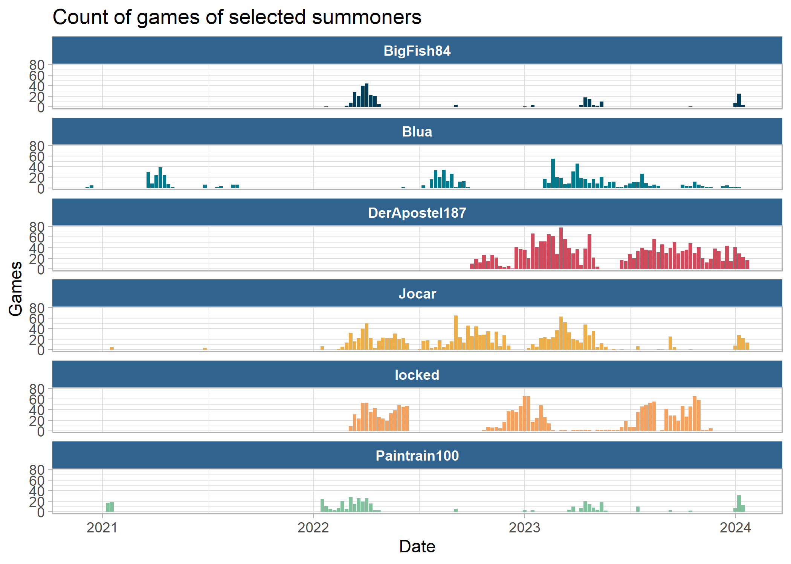
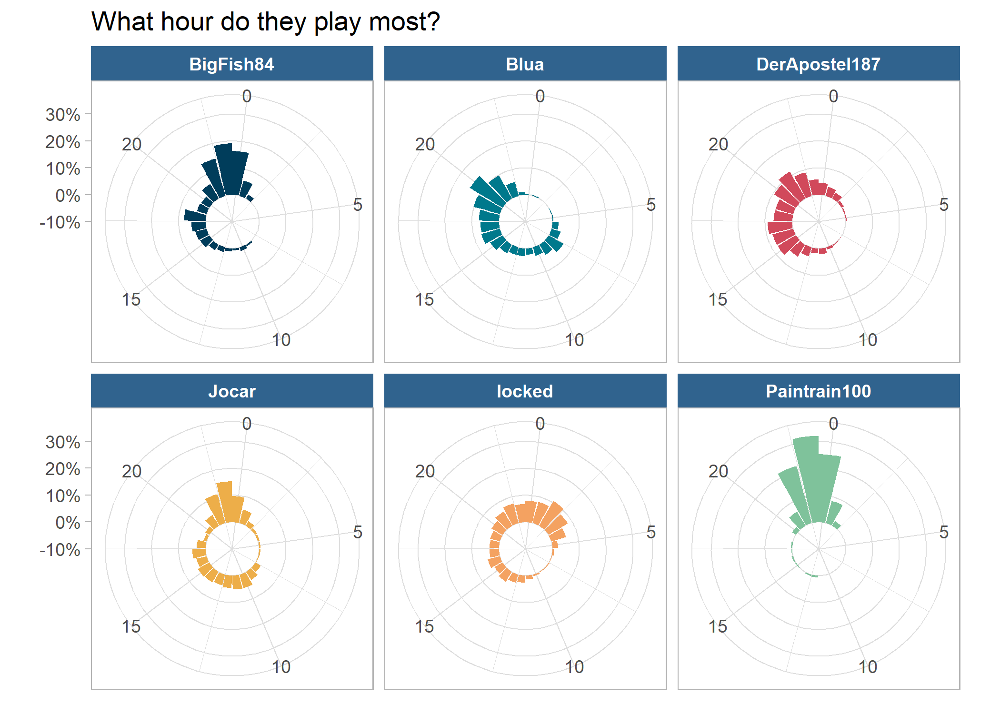
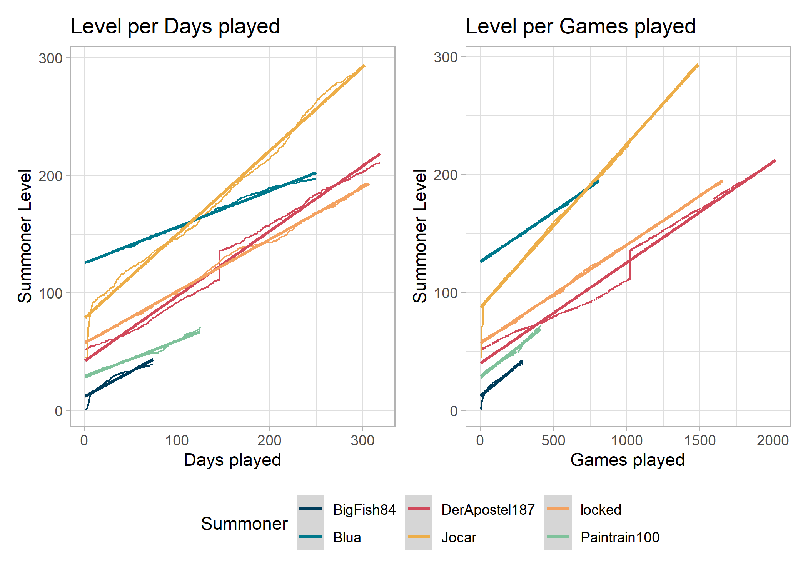

<!-- README.md is generated from README.Rmd. Please edit that file -->

# LOL Exploration

<!-- badges: start -->
<!-- badges: end -->

The goal of LOL Exploration is to …

<!-- --><!-- --><!-- --><!-- --><!-- --><!-- --><!-- -->
<table>
<caption>
Last 5 games per Summoner
</caption>
<thead>
<tr>
<th style="text-align:left;">
mode
</th>
<th style="text-align:left;">
time
</th>
<th style="text-align:left;">
summoner
</th>
<th style="text-align:left;">
champion
</th>
<th style="text-align:left;">
win
</th>
<th style="text-align:right;">
kills
</th>
<th style="text-align:right;">
assists
</th>
<th style="text-align:right;">
deaths
</th>
<th style="text-align:right;">
kda
</th>
</tr>
</thead>
<tbody>
<tr grouplength="5">
<td colspan="9" style="border-bottom: 1px solid;">
<strong>BigFish84</strong>
</td>
</tr>
<tr>
<td style="text-align:left;padding-left: 2em;" indentlevel="1">
ARAM
</td>
<td style="text-align:left;">
2023-05-03 23:59:55
</td>
<td style="text-align:left;">
BigFish84
</td>
<td style="text-align:left;">
Pantheon
</td>
<td style="text-align:left;">
TRUE
</td>
<td style="text-align:right;">
12
</td>
<td style="text-align:right;">
23
</td>
<td style="text-align:right;">
9
</td>
<td style="text-align:right;">
3.9
</td>
</tr>
<tr>
<td style="text-align:left;padding-left: 2em;" indentlevel="1">
ARAM
</td>
<td style="text-align:left;">
2023-05-03 23:39:23
</td>
<td style="text-align:left;">
BigFish84
</td>
<td style="text-align:left;">
Twitch
</td>
<td style="text-align:left;">
FALSE
</td>
<td style="text-align:right;">
6
</td>
<td style="text-align:right;">
16
</td>
<td style="text-align:right;">
10
</td>
<td style="text-align:right;">
2.2
</td>
</tr>
<tr>
<td style="text-align:left;padding-left: 2em;" indentlevel="1">
ARAM
</td>
<td style="text-align:left;">
2023-04-26 23:56:42
</td>
<td style="text-align:left;">
BigFish84
</td>
<td style="text-align:left;">
Warwick
</td>
<td style="text-align:left;">
FALSE
</td>
<td style="text-align:right;">
6
</td>
<td style="text-align:right;">
13
</td>
<td style="text-align:right;">
11
</td>
<td style="text-align:right;">
1.7
</td>
</tr>
<tr>
<td style="text-align:left;padding-left: 2em;" indentlevel="1">
ARAM
</td>
<td style="text-align:left;">
2023-04-26 23:32:46
</td>
<td style="text-align:left;">
BigFish84
</td>
<td style="text-align:left;">
TwistedFate
</td>
<td style="text-align:left;">
TRUE
</td>
<td style="text-align:right;">
3
</td>
<td style="text-align:right;">
10
</td>
<td style="text-align:right;">
10
</td>
<td style="text-align:right;">
1.3
</td>
</tr>
<tr>
<td style="text-align:left;padding-left: 2em;" indentlevel="1">
ARAM
</td>
<td style="text-align:left;">
2023-04-25 23:00:12
</td>
<td style="text-align:left;">
BigFish84
</td>
<td style="text-align:left;">
DrMundo
</td>
<td style="text-align:left;">
FALSE
</td>
<td style="text-align:right;">
4
</td>
<td style="text-align:right;">
9
</td>
<td style="text-align:right;">
10
</td>
<td style="text-align:right;">
1.3
</td>
</tr>
<tr grouplength="5">
<td colspan="9" style="border-bottom: 1px solid;">
<strong>Blua</strong>
</td>
</tr>
<tr>
<td style="text-align:left;padding-left: 2em;" indentlevel="1">
CLASSIC
</td>
<td style="text-align:left;">
2023-05-05 20:02:00
</td>
<td style="text-align:left;">
Blua
</td>
<td style="text-align:left;">
Lulu
</td>
<td style="text-align:left;">
FALSE
</td>
<td style="text-align:right;">
1
</td>
<td style="text-align:right;">
4
</td>
<td style="text-align:right;">
8
</td>
<td style="text-align:right;">
0.6
</td>
</tr>
<tr>
<td style="text-align:left;padding-left: 2em;" indentlevel="1">
CLASSIC
</td>
<td style="text-align:left;">
2023-05-01 15:52:41
</td>
<td style="text-align:left;">
Blua
</td>
<td style="text-align:left;">
Lulu
</td>
<td style="text-align:left;">
TRUE
</td>
<td style="text-align:right;">
3
</td>
<td style="text-align:right;">
32
</td>
<td style="text-align:right;">
6
</td>
<td style="text-align:right;">
5.8
</td>
</tr>
<tr>
<td style="text-align:left;padding-left: 2em;" indentlevel="1">
CLASSIC
</td>
<td style="text-align:left;">
2023-05-01 15:10:55
</td>
<td style="text-align:left;">
Blua
</td>
<td style="text-align:left;">
Lulu
</td>
<td style="text-align:left;">
TRUE
</td>
<td style="text-align:right;">
1
</td>
<td style="text-align:right;">
12
</td>
<td style="text-align:right;">
4
</td>
<td style="text-align:right;">
3.2
</td>
</tr>
<tr>
<td style="text-align:left;padding-left: 2em;" indentlevel="1">
CLASSIC
</td>
<td style="text-align:left;">
2023-05-01 12:59:38
</td>
<td style="text-align:left;">
Blua
</td>
<td style="text-align:left;">
Nami
</td>
<td style="text-align:left;">
FALSE
</td>
<td style="text-align:right;">
4
</td>
<td style="text-align:right;">
19
</td>
<td style="text-align:right;">
5
</td>
<td style="text-align:right;">
4.6
</td>
</tr>
<tr>
<td style="text-align:left;padding-left: 2em;" indentlevel="1">
CLASSIC
</td>
<td style="text-align:left;">
2023-05-01 10:09:18
</td>
<td style="text-align:left;">
Blua
</td>
<td style="text-align:left;">
Lulu
</td>
<td style="text-align:left;">
FALSE
</td>
<td style="text-align:right;">
1
</td>
<td style="text-align:right;">
22
</td>
<td style="text-align:right;">
7
</td>
<td style="text-align:right;">
3.3
</td>
</tr>
<tr grouplength="5">
<td colspan="9" style="border-bottom: 1px solid;">
<strong>Jocar</strong>
</td>
</tr>
<tr>
<td style="text-align:left;padding-left: 2em;" indentlevel="1">
CLASSIC
</td>
<td style="text-align:left;">
2023-05-05 15:01:23
</td>
<td style="text-align:left;">
DerApostel187
</td>
<td style="text-align:left;">
Lillia
</td>
<td style="text-align:left;">
TRUE
</td>
<td style="text-align:right;">
4
</td>
<td style="text-align:right;">
0
</td>
<td style="text-align:right;">
5
</td>
<td style="text-align:right;">
0.8
</td>
</tr>
<tr>
<td style="text-align:left;padding-left: 2em;" indentlevel="1">
CLASSIC
</td>
<td style="text-align:left;">
2023-05-05 14:37:49
</td>
<td style="text-align:left;">
DerApostel187
</td>
<td style="text-align:left;">
Lillia
</td>
<td style="text-align:left;">
TRUE
</td>
<td style="text-align:right;">
9
</td>
<td style="text-align:right;">
2
</td>
<td style="text-align:right;">
2
</td>
<td style="text-align:right;">
5.5
</td>
</tr>
<tr>
<td style="text-align:left;padding-left: 2em;" indentlevel="1">
CLASSIC
</td>
<td style="text-align:left;">
2023-05-05 14:01:34
</td>
<td style="text-align:left;">
DerApostel187
</td>
<td style="text-align:left;">
Lillia
</td>
<td style="text-align:left;">
TRUE
</td>
<td style="text-align:right;">
14
</td>
<td style="text-align:right;">
4
</td>
<td style="text-align:right;">
8
</td>
<td style="text-align:right;">
2.2
</td>
</tr>
<tr>
<td style="text-align:left;padding-left: 2em;" indentlevel="1">
CLASSIC
</td>
<td style="text-align:left;">
2023-05-05 13:21:52
</td>
<td style="text-align:left;">
DerApostel187
</td>
<td style="text-align:left;">
Darius
</td>
<td style="text-align:left;">
FALSE
</td>
<td style="text-align:right;">
9
</td>
<td style="text-align:right;">
2
</td>
<td style="text-align:right;">
11
</td>
<td style="text-align:right;">
1.0
</td>
</tr>
<tr>
<td style="text-align:left;padding-left: 2em;" indentlevel="1">
CLASSIC
</td>
<td style="text-align:left;">
2023-05-05 12:15:35
</td>
<td style="text-align:left;">
DerApostel187
</td>
<td style="text-align:left;">
Samira
</td>
<td style="text-align:left;">
TRUE
</td>
<td style="text-align:right;">
12
</td>
<td style="text-align:right;">
0
</td>
<td style="text-align:right;">
1
</td>
<td style="text-align:right;">
12.0
</td>
</tr>
<tr grouplength="5">
<td colspan="9" style="border-bottom: 1px solid;">
<strong>locked</strong>
</td>
</tr>
<tr>
<td style="text-align:left;padding-left: 2em;" indentlevel="1">
ARAM
</td>
<td style="text-align:left;">
2023-05-04 09:27:59
</td>
<td style="text-align:left;">
Jocar
</td>
<td style="text-align:left;">
Akshan
</td>
<td style="text-align:left;">
TRUE
</td>
<td style="text-align:right;">
7
</td>
<td style="text-align:right;">
17
</td>
<td style="text-align:right;">
8
</td>
<td style="text-align:right;">
3.0
</td>
</tr>
<tr>
<td style="text-align:left;padding-left: 2em;" indentlevel="1">
ARAM
</td>
<td style="text-align:left;">
2023-05-04 09:05:08
</td>
<td style="text-align:left;">
Jocar
</td>
<td style="text-align:left;">
Varus
</td>
<td style="text-align:left;">
FALSE
</td>
<td style="text-align:right;">
15
</td>
<td style="text-align:right;">
14
</td>
<td style="text-align:right;">
7
</td>
<td style="text-align:right;">
4.1
</td>
</tr>
<tr>
<td style="text-align:left;padding-left: 2em;" indentlevel="1">
ARAM
</td>
<td style="text-align:left;">
2023-05-04 08:43:38
</td>
<td style="text-align:left;">
Jocar
</td>
<td style="text-align:left;">
Maokai
</td>
<td style="text-align:left;">
TRUE
</td>
<td style="text-align:right;">
6
</td>
<td style="text-align:right;">
35
</td>
<td style="text-align:right;">
9
</td>
<td style="text-align:right;">
4.6
</td>
</tr>
<tr>
<td style="text-align:left;padding-left: 2em;" indentlevel="1">
ARAM
</td>
<td style="text-align:left;">
2023-05-04 08:23:20
</td>
<td style="text-align:left;">
Jocar
</td>
<td style="text-align:left;">
Zyra
</td>
<td style="text-align:left;">
TRUE
</td>
<td style="text-align:right;">
5
</td>
<td style="text-align:right;">
23
</td>
<td style="text-align:right;">
6
</td>
<td style="text-align:right;">
4.7
</td>
</tr>
<tr>
<td style="text-align:left;padding-left: 2em;" indentlevel="1">
ARAM
</td>
<td style="text-align:left;">
2023-05-03 23:59:55
</td>
<td style="text-align:left;">
Jocar
</td>
<td style="text-align:left;">
Janna
</td>
<td style="text-align:left;">
TRUE
</td>
<td style="text-align:right;">
7
</td>
<td style="text-align:right;">
42
</td>
<td style="text-align:right;">
10
</td>
<td style="text-align:right;">
4.9
</td>
</tr>
<tr grouplength="5">
<td colspan="9" style="border-bottom: 1px solid;">
<strong>Paintrain100</strong>
</td>
</tr>
<tr>
<td style="text-align:left;padding-left: 2em;" indentlevel="1">
CLASSIC
</td>
<td style="text-align:left;">
2023-04-25 16:25:53
</td>
<td style="text-align:left;">
locked
</td>
<td style="text-align:left;">
Lissandra
</td>
<td style="text-align:left;">
TRUE
</td>
<td style="text-align:right;">
8
</td>
<td style="text-align:right;">
13
</td>
<td style="text-align:right;">
6
</td>
<td style="text-align:right;">
3.5
</td>
</tr>
<tr>
<td style="text-align:left;padding-left: 2em;" indentlevel="1">
CLASSIC
</td>
<td style="text-align:left;">
2023-04-18 16:34:20
</td>
<td style="text-align:left;">
locked
</td>
<td style="text-align:left;">
Jhin
</td>
<td style="text-align:left;">
TRUE
</td>
<td style="text-align:right;">
3
</td>
<td style="text-align:right;">
5
</td>
<td style="text-align:right;">
1
</td>
<td style="text-align:right;">
8.0
</td>
</tr>
<tr>
<td style="text-align:left;padding-left: 2em;" indentlevel="1">
CLASSIC
</td>
<td style="text-align:left;">
2023-04-18 16:11:00
</td>
<td style="text-align:left;">
locked
</td>
<td style="text-align:left;">
Jhin
</td>
<td style="text-align:left;">
TRUE
</td>
<td style="text-align:right;">
8
</td>
<td style="text-align:right;">
0
</td>
<td style="text-align:right;">
0
</td>
<td style="text-align:right;">
8.0
</td>
</tr>
<tr>
<td style="text-align:left;padding-left: 2em;" indentlevel="1">
CLASSIC
</td>
<td style="text-align:left;">
2023-04-13 16:31:15
</td>
<td style="text-align:left;">
locked
</td>
<td style="text-align:left;">
Blitzcrank
</td>
<td style="text-align:left;">
FALSE
</td>
<td style="text-align:right;">
2
</td>
<td style="text-align:right;">
5
</td>
<td style="text-align:right;">
7
</td>
<td style="text-align:right;">
1.0
</td>
</tr>
<tr>
<td style="text-align:left;padding-left: 2em;" indentlevel="1">
CLASSIC
</td>
<td style="text-align:left;">
2023-04-04 16:05:48
</td>
<td style="text-align:left;">
locked
</td>
<td style="text-align:left;">
Lissandra
</td>
<td style="text-align:left;">
FALSE
</td>
<td style="text-align:right;">
12
</td>
<td style="text-align:right;">
12
</td>
<td style="text-align:right;">
5
</td>
<td style="text-align:right;">
4.8
</td>
</tr>
<tr grouplength="5">
<td colspan="9" style="border-bottom: 1px solid;">
<strong>DerApostel187</strong>
</td>
</tr>
<tr>
<td style="text-align:left;padding-left: 2em;" indentlevel="1">
ARAM
</td>
<td style="text-align:left;">
2023-05-03 23:59:55
</td>
<td style="text-align:left;">
Paintrain100
</td>
<td style="text-align:left;">
LeeSin
</td>
<td style="text-align:left;">
TRUE
</td>
<td style="text-align:right;">
12
</td>
<td style="text-align:right;">
41
</td>
<td style="text-align:right;">
14
</td>
<td style="text-align:right;">
3.8
</td>
</tr>
<tr>
<td style="text-align:left;padding-left: 2em;" indentlevel="1">
ARAM
</td>
<td style="text-align:left;">
2023-05-03 23:39:23
</td>
<td style="text-align:left;">
Paintrain100
</td>
<td style="text-align:left;">
DrMundo
</td>
<td style="text-align:left;">
FALSE
</td>
<td style="text-align:right;">
8
</td>
<td style="text-align:right;">
15
</td>
<td style="text-align:right;">
6
</td>
<td style="text-align:right;">
3.8
</td>
</tr>
<tr>
<td style="text-align:left;padding-left: 2em;" indentlevel="1">
CLASSIC
</td>
<td style="text-align:left;">
2023-05-01 00:25:17
</td>
<td style="text-align:left;">
Paintrain100
</td>
<td style="text-align:left;">
Lux
</td>
<td style="text-align:left;">
FALSE
</td>
<td style="text-align:right;">
0
</td>
<td style="text-align:right;">
0
</td>
<td style="text-align:right;">
0
</td>
<td style="text-align:right;">
0.0
</td>
</tr>
<tr>
<td style="text-align:left;padding-left: 2em;" indentlevel="1">
CLASSIC
</td>
<td style="text-align:left;">
2023-04-30 23:47:57
</td>
<td style="text-align:left;">
Paintrain100
</td>
<td style="text-align:left;">
MissFortune
</td>
<td style="text-align:left;">
FALSE
</td>
<td style="text-align:right;">
2
</td>
<td style="text-align:right;">
7
</td>
<td style="text-align:right;">
10
</td>
<td style="text-align:right;">
0.9
</td>
</tr>
<tr>
<td style="text-align:left;padding-left: 2em;" indentlevel="1">
CLASSIC
</td>
<td style="text-align:left;">
2023-04-30 23:01:25
</td>
<td style="text-align:left;">
Paintrain100
</td>
<td style="text-align:left;">
MissFortune
</td>
<td style="text-align:left;">
FALSE
</td>
<td style="text-align:right;">
7
</td>
<td style="text-align:right;">
13
</td>
<td style="text-align:right;">
12
</td>
<td style="text-align:right;">
1.7
</td>
</tr>
</tbody>
</table>

<!-- -->

## Time played

<table>
<caption>
Time play per queue ID
</caption>
<thead>
<tr>
<th style="text-align:left;">
description
</th>
<th style="text-align:right;">
BigFish84
</th>
<th style="text-align:right;">
Blua
</th>
<th style="text-align:right;">
DerApostel187
</th>
<th style="text-align:right;">
Jocar
</th>
<th style="text-align:right;">
locked
</th>
<th style="text-align:right;">
Paintrain100
</th>
</tr>
</thead>
<tbody>
<tr>
<td style="text-align:left;">
5v5 ARAM games
</td>
<td style="text-align:right;">
14H 57M 46S
</td>
<td style="text-align:right;">
41M 38S
</td>
<td style="text-align:right;">
4d 7H 14M 9S
</td>
<td style="text-align:right;">
7d 9H 32M 20S
</td>
<td style="text-align:right;">
1d 12H 59M 49S
</td>
<td style="text-align:right;">
1d 9H 23M 2S
</td>
</tr>
<tr>
<td style="text-align:left;">
5v5 Blind Pick games
</td>
<td style="text-align:right;">
3d 6H 14M 43S
</td>
<td style="text-align:right;">
1H 51M 10S
</td>
<td style="text-align:right;">
3d 6H 13M 55S
</td>
<td style="text-align:right;">
2d 16H 15M 49S
</td>
<td style="text-align:right;">
2H 36M 26S
</td>
<td style="text-align:right;">
2d 22H 6M 26S
</td>
</tr>
<tr>
<td style="text-align:left;">
5v5 Draft Pick games
</td>
<td style="text-align:right;">
4H 44M 58S
</td>
<td style="text-align:right;">
28M 37S
</td>
<td style="text-align:right;">
1d 17H 17M 10S
</td>
<td style="text-align:right;">
2d 4H 48M 4S
</td>
<td style="text-align:right;">
16H 9M 36S
</td>
<td style="text-align:right;">
5H 8M 9S
</td>
</tr>
<tr>
<td style="text-align:left;">
5v5 Ranked Flex games
</td>
<td style="text-align:right;">
2H 13M 51S
</td>
<td style="text-align:right;">
0S
</td>
<td style="text-align:right;">
0S
</td>
<td style="text-align:right;">
2H 13M 51S
</td>
<td style="text-align:right;">
0S
</td>
<td style="text-align:right;">
2H 13M 51S
</td>
</tr>
<tr>
<td style="text-align:left;">
5v5 Ranked Solo games
</td>
<td style="text-align:right;">
0S
</td>
<td style="text-align:right;">
9d 5H 33M 36S
</td>
<td style="text-align:right;">
0S
</td>
<td style="text-align:right;">
11d 1H 28M 43S
</td>
<td style="text-align:right;">
15d 15H 13M 38S
</td>
<td style="text-align:right;">
12H 41M 28S
</td>
</tr>
<tr>
<td style="text-align:left;">
ARURF games
</td>
<td style="text-align:right;">
0S
</td>
<td style="text-align:right;">
0S
</td>
<td style="text-align:right;">
3d 22H 29M 12S
</td>
<td style="text-align:right;">
30M 39S
</td>
<td style="text-align:right;">
18H 10M 29S
</td>
<td style="text-align:right;">
0S
</td>
</tr>
<tr>
<td style="text-align:left;">
Co-op vs. AI Beginner Bot games
</td>
<td style="text-align:right;">
34M 37S
</td>
<td style="text-align:right;">
59M 28S
</td>
<td style="text-align:right;">
19H 20M 4S
</td>
<td style="text-align:right;">
0S
</td>
<td style="text-align:right;">
0S
</td>
<td style="text-align:right;">
0S
</td>
</tr>
<tr>
<td style="text-align:left;">
Co-op vs. AI Intermediate Bot games
</td>
<td style="text-align:right;">
45M 18S
</td>
<td style="text-align:right;">
0S
</td>
<td style="text-align:right;">
0S
</td>
<td style="text-align:right;">
45M 18S
</td>
<td style="text-align:right;">
0S
</td>
<td style="text-align:right;">
45M 18S
</td>
</tr>
<tr>
<td style="text-align:left;">
One for All games
</td>
<td style="text-align:right;">
1H 26M 28S
</td>
<td style="text-align:right;">
0S
</td>
<td style="text-align:right;">
0S
</td>
<td style="text-align:right;">
2H 46M 42S
</td>
<td style="text-align:right;">
44M 12S
</td>
<td style="text-align:right;">
43M 33S
</td>
</tr>
<tr>
<td style="text-align:left;">
Pick URF games
</td>
<td style="text-align:right;">
0S
</td>
<td style="text-align:right;">
0S
</td>
<td style="text-align:right;">
1d 4H 48M 38S
</td>
<td style="text-align:right;">
0S
</td>
<td style="text-align:right;">
6H 52M 37S
</td>
<td style="text-align:right;">
0S
</td>
</tr>
<tr>
<td style="text-align:left;">
Tutorial 1
</td>
<td style="text-align:right;">
2M 14S
</td>
<td style="text-align:right;">
0S
</td>
<td style="text-align:right;">
0S
</td>
<td style="text-align:right;">
0S
</td>
<td style="text-align:right;">
24S
</td>
<td style="text-align:right;">
0S
</td>
</tr>
<tr>
<td style="text-align:left;">
Ultimate Spellbook games
</td>
<td style="text-align:right;">
0S
</td>
<td style="text-align:right;">
0S
</td>
<td style="text-align:right;">
0S
</td>
<td style="text-align:right;">
15M 27S
</td>
<td style="text-align:right;">
0S
</td>
<td style="text-align:right;">
0S
</td>
</tr>
<tr>
<td style="text-align:left;">
NA
</td>
<td style="text-align:right;">
0S
</td>
<td style="text-align:right;">
0S
</td>
<td style="text-align:right;">
0S
</td>
<td style="text-align:right;">
0S
</td>
<td style="text-align:right;">
1H 29M 7S
</td>
<td style="text-align:right;">
45M 38S
</td>
</tr>
<tr>
<td style="text-align:left;">
Total
</td>
<td style="text-align:right;">
4d 6H 59M 55S
</td>
<td style="text-align:right;">
9d 9H 34M 29S
</td>
<td style="text-align:right;">
15d 5H 23M 8S
</td>
<td style="text-align:right;">
23d 14H 36M 53S
</td>
<td style="text-align:right;">
19d 2H 16M 18S
</td>
<td style="text-align:right;">
5d 5H 47M 25S
</td>
</tr>
</tbody>
</table>
