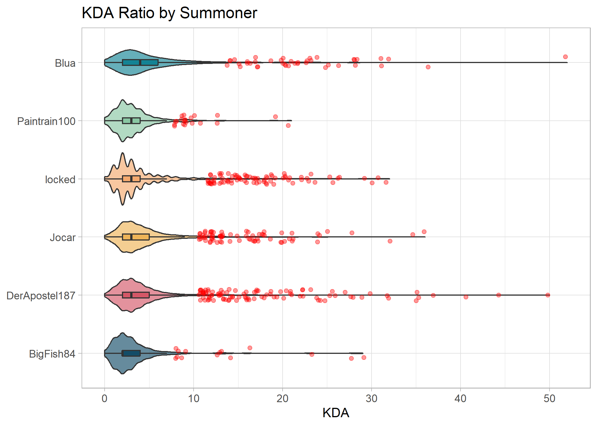

<!-- README.md is generated from README.Rmd. Please edit that file -->

# LOL Exploration

<!-- badges: start -->
<!-- badges: end -->

The goal of LOL Exploration is to …

<!-- --><!-- --><!-- --><!-- --><!-- --><!-- --><!-- -->
<table>
<caption>
Last 5 games per Summoner
</caption>
<thead>
<tr>
<th style="text-align:left;">
mode
</th>
<th style="text-align:left;">
time
</th>
<th style="text-align:left;">
summoner
</th>
<th style="text-align:left;">
champion
</th>
<th style="text-align:left;">
win
</th>
<th style="text-align:right;">
kills
</th>
<th style="text-align:right;">
assists
</th>
<th style="text-align:right;">
deaths
</th>
<th style="text-align:right;">
kda
</th>
</tr>
</thead>
<tbody>
<tr grouplength="5">
<td colspan="9" style="border-bottom: 1px solid;">
<strong>BigFish84</strong>
</td>
</tr>
<tr>
<td style="text-align:left;padding-left: 2em;" indentlevel="1">
CLASSIC
</td>
<td style="text-align:left;">
2022-04-28 00:02:59
</td>
<td style="text-align:left;">
BigFish84
</td>
<td style="text-align:left;">
Singed
</td>
<td style="text-align:left;">
TRUE
</td>
<td style="text-align:right;">
1
</td>
<td style="text-align:right;">
12
</td>
<td style="text-align:right;">
12
</td>
<td style="text-align:right;">
1.1
</td>
</tr>
<tr>
<td style="text-align:left;padding-left: 2em;" indentlevel="1">
CLASSIC
</td>
<td style="text-align:left;">
2022-04-27 23:37:51
</td>
<td style="text-align:left;">
BigFish84
</td>
<td style="text-align:left;">
Singed
</td>
<td style="text-align:left;">
TRUE
</td>
<td style="text-align:right;">
3
</td>
<td style="text-align:right;">
4
</td>
<td style="text-align:right;">
2
</td>
<td style="text-align:right;">
3.5
</td>
</tr>
<tr>
<td style="text-align:left;padding-left: 2em;" indentlevel="1">
CLASSIC
</td>
<td style="text-align:left;">
2022-04-27 23:04:07
</td>
<td style="text-align:left;">
BigFish84
</td>
<td style="text-align:left;">
Singed
</td>
<td style="text-align:left;">
FALSE
</td>
<td style="text-align:right;">
2
</td>
<td style="text-align:right;">
8
</td>
<td style="text-align:right;">
9
</td>
<td style="text-align:right;">
1.1
</td>
</tr>
<tr>
<td style="text-align:left;padding-left: 2em;" indentlevel="1">
CLASSIC
</td>
<td style="text-align:left;">
2022-04-24 23:59:00
</td>
<td style="text-align:left;">
BigFish84
</td>
<td style="text-align:left;">
Singed
</td>
<td style="text-align:left;">
FALSE
</td>
<td style="text-align:right;">
5
</td>
<td style="text-align:right;">
14
</td>
<td style="text-align:right;">
8
</td>
<td style="text-align:right;">
2.4
</td>
</tr>
<tr>
<td style="text-align:left;padding-left: 2em;" indentlevel="1">
ARAM
</td>
<td style="text-align:left;">
2022-04-24 23:42:14
</td>
<td style="text-align:left;">
BigFish84
</td>
<td style="text-align:left;">
Khazix
</td>
<td style="text-align:left;">
FALSE
</td>
<td style="text-align:right;">
1
</td>
<td style="text-align:right;">
8
</td>
<td style="text-align:right;">
10
</td>
<td style="text-align:right;">
0.9
</td>
</tr>
<tr grouplength="5">
<td colspan="9" style="border-bottom: 1px solid;">
<strong>Blua</strong>
</td>
</tr>
<tr>
<td style="text-align:left;padding-left: 2em;" indentlevel="1">
CLASSIC
</td>
<td style="text-align:left;">
2022-07-24 20:46:55
</td>
<td style="text-align:left;">
Blua
</td>
<td style="text-align:left;">
Janna
</td>
<td style="text-align:left;">
FALSE
</td>
<td style="text-align:right;">
1
</td>
<td style="text-align:right;">
26
</td>
<td style="text-align:right;">
7
</td>
<td style="text-align:right;">
3.9
</td>
</tr>
<tr>
<td style="text-align:left;padding-left: 2em;" indentlevel="1">
CLASSIC
</td>
<td style="text-align:left;">
2022-07-24 20:00:25
</td>
<td style="text-align:left;">
Blua
</td>
<td style="text-align:left;">
Janna
</td>
<td style="text-align:left;">
TRUE
</td>
<td style="text-align:right;">
1
</td>
<td style="text-align:right;">
11
</td>
<td style="text-align:right;">
2
</td>
<td style="text-align:right;">
6.0
</td>
</tr>
<tr>
<td style="text-align:left;padding-left: 2em;" indentlevel="1">
CLASSIC
</td>
<td style="text-align:left;">
2022-07-24 19:28:23
</td>
<td style="text-align:left;">
Blua
</td>
<td style="text-align:left;">
Janna
</td>
<td style="text-align:left;">
TRUE
</td>
<td style="text-align:right;">
0
</td>
<td style="text-align:right;">
13
</td>
<td style="text-align:right;">
2
</td>
<td style="text-align:right;">
6.5
</td>
</tr>
<tr>
<td style="text-align:left;padding-left: 2em;" indentlevel="1">
CLASSIC
</td>
<td style="text-align:left;">
2022-07-24 17:42:28
</td>
<td style="text-align:left;">
Blua
</td>
<td style="text-align:left;">
Janna
</td>
<td style="text-align:left;">
FALSE
</td>
<td style="text-align:right;">
0
</td>
<td style="text-align:right;">
2
</td>
<td style="text-align:right;">
4
</td>
<td style="text-align:right;">
0.5
</td>
</tr>
<tr>
<td style="text-align:left;padding-left: 2em;" indentlevel="1">
CLASSIC
</td>
<td style="text-align:left;">
2022-07-24 16:38:21
</td>
<td style="text-align:left;">
Blua
</td>
<td style="text-align:left;">
Janna
</td>
<td style="text-align:left;">
FALSE
</td>
<td style="text-align:right;">
0
</td>
<td style="text-align:right;">
14
</td>
<td style="text-align:right;">
6
</td>
<td style="text-align:right;">
2.3
</td>
</tr>
<tr grouplength="5">
<td colspan="9" style="border-bottom: 1px solid;">
<strong>Jocar</strong>
</td>
</tr>
<tr>
<td style="text-align:left;padding-left: 2em;" indentlevel="1">
ARAM
</td>
<td style="text-align:left;">
2022-07-24 00:41:02
</td>
<td style="text-align:left;">
Jocar
</td>
<td style="text-align:left;">
Ashe
</td>
<td style="text-align:left;">
TRUE
</td>
<td style="text-align:right;">
10
</td>
<td style="text-align:right;">
28
</td>
<td style="text-align:right;">
8
</td>
<td style="text-align:right;">
4.8
</td>
</tr>
<tr>
<td style="text-align:left;padding-left: 2em;" indentlevel="1">
ARAM
</td>
<td style="text-align:left;">
2022-07-24 00:15:50
</td>
<td style="text-align:left;">
Jocar
</td>
<td style="text-align:left;">
Varus
</td>
<td style="text-align:left;">
TRUE
</td>
<td style="text-align:right;">
6
</td>
<td style="text-align:right;">
33
</td>
<td style="text-align:right;">
5
</td>
<td style="text-align:right;">
7.8
</td>
</tr>
<tr>
<td style="text-align:left;padding-left: 2em;" indentlevel="1">
ARAM
</td>
<td style="text-align:left;">
2022-07-23 23:49:17
</td>
<td style="text-align:left;">
Jocar
</td>
<td style="text-align:left;">
Blitzcrank
</td>
<td style="text-align:left;">
TRUE
</td>
<td style="text-align:right;">
2
</td>
<td style="text-align:right;">
23
</td>
<td style="text-align:right;">
13
</td>
<td style="text-align:right;">
1.9
</td>
</tr>
<tr>
<td style="text-align:left;padding-left: 2em;" indentlevel="1">
CLASSIC
</td>
<td style="text-align:left;">
2022-07-23 23:20:36
</td>
<td style="text-align:left;">
Jocar
</td>
<td style="text-align:left;">
Volibear
</td>
<td style="text-align:left;">
TRUE
</td>
<td style="text-align:right;">
6
</td>
<td style="text-align:right;">
3
</td>
<td style="text-align:right;">
4
</td>
<td style="text-align:right;">
2.2
</td>
</tr>
<tr>
<td style="text-align:left;padding-left: 2em;" indentlevel="1">
CLASSIC
</td>
<td style="text-align:left;">
2022-07-23 15:08:43
</td>
<td style="text-align:left;">
Jocar
</td>
<td style="text-align:left;">
Lux
</td>
<td style="text-align:left;">
TRUE
</td>
<td style="text-align:right;">
6
</td>
<td style="text-align:right;">
12
</td>
<td style="text-align:right;">
1
</td>
<td style="text-align:right;">
18.0
</td>
</tr>
<tr grouplength="5">
<td colspan="9" style="border-bottom: 1px solid;">
<strong>locked</strong>
</td>
</tr>
<tr>
<td style="text-align:left;padding-left: 2em;" indentlevel="1">
CLASSIC
</td>
<td style="text-align:left;">
2022-06-18 02:50:11
</td>
<td style="text-align:left;">
locked
</td>
<td style="text-align:left;">
Renata
</td>
<td style="text-align:left;">
TRUE
</td>
<td style="text-align:right;">
1
</td>
<td style="text-align:right;">
22
</td>
<td style="text-align:right;">
3
</td>
<td style="text-align:right;">
7.7
</td>
</tr>
<tr>
<td style="text-align:left;padding-left: 2em;" indentlevel="1">
CLASSIC
</td>
<td style="text-align:left;">
2022-06-17 16:01:50
</td>
<td style="text-align:left;">
locked
</td>
<td style="text-align:left;">
Renata
</td>
<td style="text-align:left;">
FALSE
</td>
<td style="text-align:right;">
1
</td>
<td style="text-align:right;">
19
</td>
<td style="text-align:right;">
10
</td>
<td style="text-align:right;">
2.0
</td>
</tr>
<tr>
<td style="text-align:left;padding-left: 2em;" indentlevel="1">
CLASSIC
</td>
<td style="text-align:left;">
2022-06-17 01:47:07
</td>
<td style="text-align:left;">
locked
</td>
<td style="text-align:left;">
Renata
</td>
<td style="text-align:left;">
TRUE
</td>
<td style="text-align:right;">
2
</td>
<td style="text-align:right;">
12
</td>
<td style="text-align:right;">
3
</td>
<td style="text-align:right;">
4.7
</td>
</tr>
<tr>
<td style="text-align:left;padding-left: 2em;" indentlevel="1">
CLASSIC
</td>
<td style="text-align:left;">
2022-06-17 01:06:49
</td>
<td style="text-align:left;">
locked
</td>
<td style="text-align:left;">
Renata
</td>
<td style="text-align:left;">
TRUE
</td>
<td style="text-align:right;">
0
</td>
<td style="text-align:right;">
20
</td>
<td style="text-align:right;">
5
</td>
<td style="text-align:right;">
4.0
</td>
</tr>
<tr>
<td style="text-align:left;padding-left: 2em;" indentlevel="1">
ARAM
</td>
<td style="text-align:left;">
2022-06-16 23:59:36
</td>
<td style="text-align:left;">
locked
</td>
<td style="text-align:left;">
Tristana
</td>
<td style="text-align:left;">
TRUE
</td>
<td style="text-align:right;">
16
</td>
<td style="text-align:right;">
17
</td>
<td style="text-align:right;">
6
</td>
<td style="text-align:right;">
5.5
</td>
</tr>
<tr grouplength="5">
<td colspan="9" style="border-bottom: 1px solid;">
<strong>Paintrain100</strong>
</td>
</tr>
<tr>
<td style="text-align:left;padding-left: 2em;" indentlevel="1">
CLASSIC
</td>
<td style="text-align:left;">
2022-04-25 23:36:49
</td>
<td style="text-align:left;">
Paintrain100
</td>
<td style="text-align:left;">
MissFortune
</td>
<td style="text-align:left;">
FALSE
</td>
<td style="text-align:right;">
13
</td>
<td style="text-align:right;">
11
</td>
<td style="text-align:right;">
7
</td>
<td style="text-align:right;">
3.4
</td>
</tr>
<tr>
<td style="text-align:left;padding-left: 2em;" indentlevel="1">
CLASSIC
</td>
<td style="text-align:left;">
2022-04-24 23:59:00
</td>
<td style="text-align:left;">
Paintrain100
</td>
<td style="text-align:left;">
MissFortune
</td>
<td style="text-align:left;">
FALSE
</td>
<td style="text-align:right;">
0
</td>
<td style="text-align:right;">
4
</td>
<td style="text-align:right;">
0
</td>
<td style="text-align:right;">
4.0
</td>
</tr>
<tr>
<td style="text-align:left;padding-left: 2em;" indentlevel="1">
ARAM
</td>
<td style="text-align:left;">
2022-04-24 23:42:14
</td>
<td style="text-align:left;">
Paintrain100
</td>
<td style="text-align:left;">
Xayah
</td>
<td style="text-align:left;">
FALSE
</td>
<td style="text-align:right;">
2
</td>
<td style="text-align:right;">
6
</td>
<td style="text-align:right;">
6
</td>
<td style="text-align:right;">
1.3
</td>
</tr>
<tr>
<td style="text-align:left;padding-left: 2em;" indentlevel="1">
CLASSIC
</td>
<td style="text-align:left;">
2022-04-18 00:15:55
</td>
<td style="text-align:left;">
Paintrain100
</td>
<td style="text-align:left;">
MissFortune
</td>
<td style="text-align:left;">
TRUE
</td>
<td style="text-align:right;">
13
</td>
<td style="text-align:right;">
12
</td>
<td style="text-align:right;">
7
</td>
<td style="text-align:right;">
3.6
</td>
</tr>
<tr>
<td style="text-align:left;padding-left: 2em;" indentlevel="1">
CLASSIC
</td>
<td style="text-align:left;">
2022-04-17 23:38:43
</td>
<td style="text-align:left;">
Paintrain100
</td>
<td style="text-align:left;">
MissFortune
</td>
<td style="text-align:left;">
TRUE
</td>
<td style="text-align:right;">
9
</td>
<td style="text-align:right;">
11
</td>
<td style="text-align:right;">
7
</td>
<td style="text-align:right;">
2.9
</td>
</tr>
</tbody>
</table>
