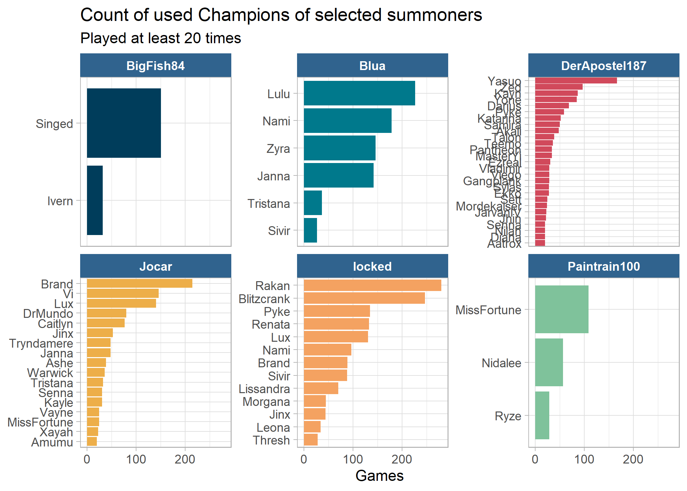
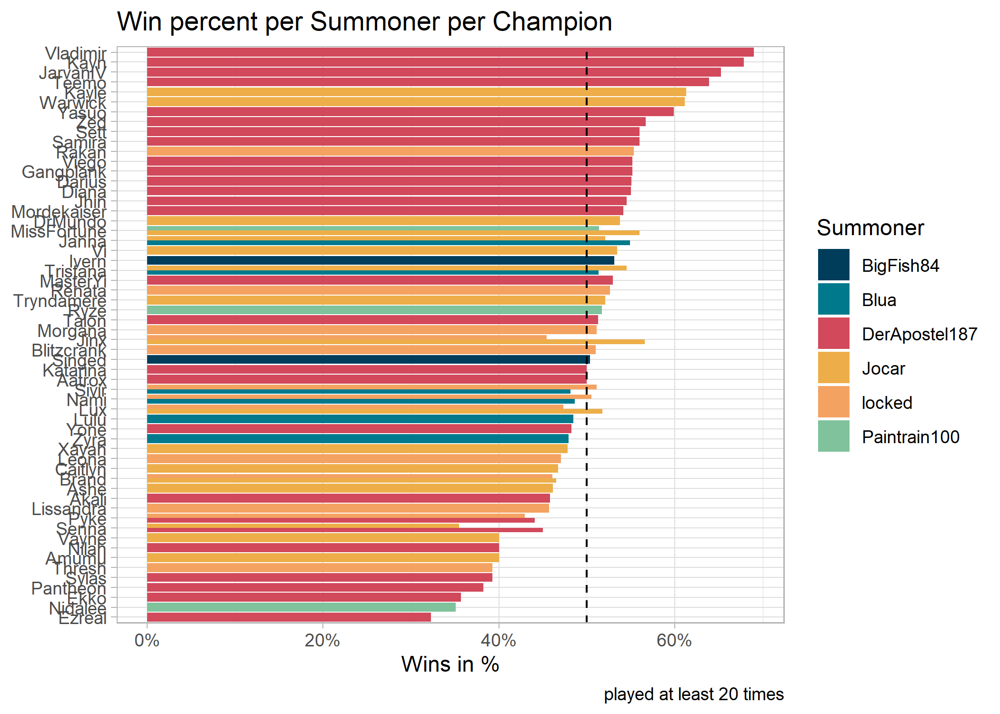

<!-- README.md is generated from README.Rmd. Please edit that file -->

# LOL Exploration

<!-- badges: start -->
<!-- badges: end -->

The goal of LOL Exploration is to …

<!-- --><!-- --><!-- --><!-- --><!-- --><!-- --><!-- -->
<table>
<caption>
Last 5 games per Summoner
</caption>
<thead>
<tr>
<th style="text-align:left;">
mode
</th>
<th style="text-align:left;">
time
</th>
<th style="text-align:left;">
summoner
</th>
<th style="text-align:left;">
champion
</th>
<th style="text-align:left;">
win
</th>
<th style="text-align:right;">
kills
</th>
<th style="text-align:right;">
assists
</th>
<th style="text-align:right;">
deaths
</th>
<th style="text-align:right;">
kda
</th>
</tr>
</thead>
<tbody>
<tr grouplength="5">
<td colspan="9" style="border-bottom: 1px solid;">
<strong>BigFish84</strong>
</td>
</tr>
<tr>
<td style="text-align:left;padding-left: 2em;" indentlevel="1">
CLASSIC
</td>
<td style="text-align:left;">
2023-01-21 00:52:26
</td>
<td style="text-align:left;">
BigFish84
</td>
<td style="text-align:left;">
Singed
</td>
<td style="text-align:left;">
TRUE
</td>
<td style="text-align:right;">
2
</td>
<td style="text-align:right;">
4
</td>
<td style="text-align:right;">
10
</td>
<td style="text-align:right;">
0.6
</td>
</tr>
<tr>
<td style="text-align:left;padding-left: 2em;" indentlevel="1">
CLASSIC
</td>
<td style="text-align:left;">
2023-01-21 00:19:11
</td>
<td style="text-align:left;">
BigFish84
</td>
<td style="text-align:left;">
Singed
</td>
<td style="text-align:left;">
TRUE
</td>
<td style="text-align:right;">
1
</td>
<td style="text-align:right;">
5
</td>
<td style="text-align:right;">
5
</td>
<td style="text-align:right;">
1.2
</td>
</tr>
<tr>
<td style="text-align:left;padding-left: 2em;" indentlevel="1">
ARAM
</td>
<td style="text-align:left;">
2023-01-20 23:53:37
</td>
<td style="text-align:left;">
BigFish84
</td>
<td style="text-align:left;">
Karthus
</td>
<td style="text-align:left;">
FALSE
</td>
<td style="text-align:right;">
6
</td>
<td style="text-align:right;">
29
</td>
<td style="text-align:right;">
12
</td>
<td style="text-align:right;">
2.9
</td>
</tr>
<tr>
<td style="text-align:left;padding-left: 2em;" indentlevel="1">
CLASSIC
</td>
<td style="text-align:left;">
2023-01-07 22:57:59
</td>
<td style="text-align:left;">
BigFish84
</td>
<td style="text-align:left;">
Singed
</td>
<td style="text-align:left;">
TRUE
</td>
<td style="text-align:right;">
3
</td>
<td style="text-align:right;">
9
</td>
<td style="text-align:right;">
4
</td>
<td style="text-align:right;">
3.0
</td>
</tr>
<tr>
<td style="text-align:left;padding-left: 2em;" indentlevel="1">
ARAM
</td>
<td style="text-align:left;">
2022-09-09 00:24:24
</td>
<td style="text-align:left;">
BigFish84
</td>
<td style="text-align:left;">
Singed
</td>
<td style="text-align:left;">
TRUE
</td>
<td style="text-align:right;">
5
</td>
<td style="text-align:right;">
15
</td>
<td style="text-align:right;">
10
</td>
<td style="text-align:right;">
2.0
</td>
</tr>
<tr grouplength="5">
<td colspan="9" style="border-bottom: 1px solid;">
<strong>Blua</strong>
</td>
</tr>
<tr>
<td style="text-align:left;padding-left: 2em;" indentlevel="1">
CLASSIC
</td>
<td style="text-align:left;">
2023-02-27 20:25:04
</td>
<td style="text-align:left;">
Blua
</td>
<td style="text-align:left;">
Lulu
</td>
<td style="text-align:left;">
FALSE
</td>
<td style="text-align:right;">
2
</td>
<td style="text-align:right;">
17
</td>
<td style="text-align:right;">
3
</td>
<td style="text-align:right;">
6.3
</td>
</tr>
<tr>
<td style="text-align:left;padding-left: 2em;" indentlevel="1">
CLASSIC
</td>
<td style="text-align:left;">
2023-02-26 20:35:14
</td>
<td style="text-align:left;">
Blua
</td>
<td style="text-align:left;">
Nami
</td>
<td style="text-align:left;">
FALSE
</td>
<td style="text-align:right;">
1
</td>
<td style="text-align:right;">
10
</td>
<td style="text-align:right;">
5
</td>
<td style="text-align:right;">
2.2
</td>
</tr>
<tr>
<td style="text-align:left;padding-left: 2em;" indentlevel="1">
CLASSIC
</td>
<td style="text-align:left;">
2023-02-26 19:29:57
</td>
<td style="text-align:left;">
Blua
</td>
<td style="text-align:left;">
Nami
</td>
<td style="text-align:left;">
TRUE
</td>
<td style="text-align:right;">
1
</td>
<td style="text-align:right;">
18
</td>
<td style="text-align:right;">
2
</td>
<td style="text-align:right;">
9.5
</td>
</tr>
<tr>
<td style="text-align:left;padding-left: 2em;" indentlevel="1">
CLASSIC
</td>
<td style="text-align:left;">
2023-02-26 16:55:31
</td>
<td style="text-align:left;">
Blua
</td>
<td style="text-align:left;">
Lulu
</td>
<td style="text-align:left;">
FALSE
</td>
<td style="text-align:right;">
0
</td>
<td style="text-align:right;">
9
</td>
<td style="text-align:right;">
4
</td>
<td style="text-align:right;">
2.2
</td>
</tr>
<tr>
<td style="text-align:left;padding-left: 2em;" indentlevel="1">
CLASSIC
</td>
<td style="text-align:left;">
2023-02-26 14:25:34
</td>
<td style="text-align:left;">
Blua
</td>
<td style="text-align:left;">
Janna
</td>
<td style="text-align:left;">
FALSE
</td>
<td style="text-align:right;">
1
</td>
<td style="text-align:right;">
8
</td>
<td style="text-align:right;">
5
</td>
<td style="text-align:right;">
1.8
</td>
</tr>
<tr grouplength="5">
<td colspan="9" style="border-bottom: 1px solid;">
<strong>Jocar</strong>
</td>
</tr>
<tr>
<td style="text-align:left;padding-left: 2em;" indentlevel="1">
ARAM
</td>
<td style="text-align:left;">
2023-02-27 23:50:33
</td>
<td style="text-align:left;">
Jocar
</td>
<td style="text-align:left;">
Tristana
</td>
<td style="text-align:left;">
TRUE
</td>
<td style="text-align:right;">
7
</td>
<td style="text-align:right;">
6
</td>
<td style="text-align:right;">
3
</td>
<td style="text-align:right;">
4.3
</td>
</tr>
<tr>
<td style="text-align:left;padding-left: 2em;" indentlevel="1">
ARAM
</td>
<td style="text-align:left;">
2023-02-27 23:29:43
</td>
<td style="text-align:left;">
Jocar
</td>
<td style="text-align:left;">
Kayle
</td>
<td style="text-align:left;">
TRUE
</td>
<td style="text-align:right;">
5
</td>
<td style="text-align:right;">
24
</td>
<td style="text-align:right;">
12
</td>
<td style="text-align:right;">
2.4
</td>
</tr>
<tr>
<td style="text-align:left;padding-left: 2em;" indentlevel="1">
ARAM
</td>
<td style="text-align:left;">
2023-02-27 23:06:57
</td>
<td style="text-align:left;">
Jocar
</td>
<td style="text-align:left;">
Vayne
</td>
<td style="text-align:left;">
TRUE
</td>
<td style="text-align:right;">
8
</td>
<td style="text-align:right;">
13
</td>
<td style="text-align:right;">
6
</td>
<td style="text-align:right;">
3.5
</td>
</tr>
<tr>
<td style="text-align:left;padding-left: 2em;" indentlevel="1">
ARAM
</td>
<td style="text-align:left;">
2023-02-27 22:41:23
</td>
<td style="text-align:left;">
Jocar
</td>
<td style="text-align:left;">
Tristana
</td>
<td style="text-align:left;">
TRUE
</td>
<td style="text-align:right;">
12
</td>
<td style="text-align:right;">
42
</td>
<td style="text-align:right;">
7
</td>
<td style="text-align:right;">
7.7
</td>
</tr>
<tr>
<td style="text-align:left;padding-left: 2em;" indentlevel="1">
ARAM
</td>
<td style="text-align:left;">
2023-02-27 22:18:13
</td>
<td style="text-align:left;">
Jocar
</td>
<td style="text-align:left;">
Jinx
</td>
<td style="text-align:left;">
FALSE
</td>
<td style="text-align:right;">
9
</td>
<td style="text-align:right;">
16
</td>
<td style="text-align:right;">
8
</td>
<td style="text-align:right;">
3.1
</td>
</tr>
<tr grouplength="5">
<td colspan="9" style="border-bottom: 1px solid;">
<strong>locked</strong>
</td>
</tr>
<tr>
<td style="text-align:left;padding-left: 2em;" indentlevel="1">
CLASSIC
</td>
<td style="text-align:left;">
2023-02-21 16:11:46
</td>
<td style="text-align:left;">
locked
</td>
<td style="text-align:left;">
Janna
</td>
<td style="text-align:left;">
TRUE
</td>
<td style="text-align:right;">
0
</td>
<td style="text-align:right;">
6
</td>
<td style="text-align:right;">
7
</td>
<td style="text-align:right;">
0.9
</td>
</tr>
<tr>
<td style="text-align:left;padding-left: 2em;" indentlevel="1">
ARAM
</td>
<td style="text-align:left;">
2023-02-17 20:36:42
</td>
<td style="text-align:left;">
locked
</td>
<td style="text-align:left;">
Xayah
</td>
<td style="text-align:left;">
FALSE
</td>
<td style="text-align:right;">
6
</td>
<td style="text-align:right;">
8
</td>
<td style="text-align:right;">
7
</td>
<td style="text-align:right;">
2.0
</td>
</tr>
<tr>
<td style="text-align:left;padding-left: 2em;" indentlevel="1">
ARAM
</td>
<td style="text-align:left;">
2023-02-17 20:21:05
</td>
<td style="text-align:left;">
locked
</td>
<td style="text-align:left;">
Kaisa
</td>
<td style="text-align:left;">
FALSE
</td>
<td style="text-align:right;">
12
</td>
<td style="text-align:right;">
9
</td>
<td style="text-align:right;">
7
</td>
<td style="text-align:right;">
3.0
</td>
</tr>
<tr>
<td style="text-align:left;padding-left: 2em;" indentlevel="1">
URF
</td>
<td style="text-align:left;">
2023-02-16 00:22:33
</td>
<td style="text-align:left;">
locked
</td>
<td style="text-align:left;">
Blitzcrank
</td>
<td style="text-align:left;">
TRUE
</td>
<td style="text-align:right;">
3
</td>
<td style="text-align:right;">
8
</td>
<td style="text-align:right;">
7
</td>
<td style="text-align:right;">
1.6
</td>
</tr>
<tr>
<td style="text-align:left;padding-left: 2em;" indentlevel="1">
URF
</td>
<td style="text-align:left;">
2023-02-15 23:58:55
</td>
<td style="text-align:left;">
locked
</td>
<td style="text-align:left;">
Anivia
</td>
<td style="text-align:left;">
FALSE
</td>
<td style="text-align:right;">
8
</td>
<td style="text-align:right;">
11
</td>
<td style="text-align:right;">
9
</td>
<td style="text-align:right;">
2.1
</td>
</tr>
<tr grouplength="5">
<td colspan="9" style="border-bottom: 1px solid;">
<strong>Paintrain100</strong>
</td>
</tr>
<tr>
<td style="text-align:left;padding-left: 2em;" indentlevel="1">
CLASSIC
</td>
<td style="text-align:left;">
2023-01-21 00:52:26
</td>
<td style="text-align:left;">
Paintrain100
</td>
<td style="text-align:left;">
MissFortune
</td>
<td style="text-align:left;">
TRUE
</td>
<td style="text-align:right;">
6
</td>
<td style="text-align:right;">
13
</td>
<td style="text-align:right;">
9
</td>
<td style="text-align:right;">
2.1
</td>
</tr>
<tr>
<td style="text-align:left;padding-left: 2em;" indentlevel="1">
CLASSIC
</td>
<td style="text-align:left;">
2023-01-21 00:19:11
</td>
<td style="text-align:left;">
Paintrain100
</td>
<td style="text-align:left;">
MissFortune
</td>
<td style="text-align:left;">
TRUE
</td>
<td style="text-align:right;">
8
</td>
<td style="text-align:right;">
11
</td>
<td style="text-align:right;">
5
</td>
<td style="text-align:right;">
3.8
</td>
</tr>
<tr>
<td style="text-align:left;padding-left: 2em;" indentlevel="1">
ARAM
</td>
<td style="text-align:left;">
2023-01-20 23:53:37
</td>
<td style="text-align:left;">
Paintrain100
</td>
<td style="text-align:left;">
MissFortune
</td>
<td style="text-align:left;">
FALSE
</td>
<td style="text-align:right;">
9
</td>
<td style="text-align:right;">
30
</td>
<td style="text-align:right;">
7
</td>
<td style="text-align:right;">
5.6
</td>
</tr>
<tr>
<td style="text-align:left;padding-left: 2em;" indentlevel="1">
CLASSIC
</td>
<td style="text-align:left;">
2023-01-07 22:57:59
</td>
<td style="text-align:left;">
Paintrain100
</td>
<td style="text-align:left;">
MissFortune
</td>
<td style="text-align:left;">
TRUE
</td>
<td style="text-align:right;">
9
</td>
<td style="text-align:right;">
4
</td>
<td style="text-align:right;">
1
</td>
<td style="text-align:right;">
13.0
</td>
</tr>
<tr>
<td style="text-align:left;padding-left: 2em;" indentlevel="1">
ARAM
</td>
<td style="text-align:left;">
2023-01-07 22:37:28
</td>
<td style="text-align:left;">
Paintrain100
</td>
<td style="text-align:left;">
Yasuo
</td>
<td style="text-align:left;">
FALSE
</td>
<td style="text-align:right;">
2
</td>
<td style="text-align:right;">
9
</td>
<td style="text-align:right;">
8
</td>
<td style="text-align:right;">
1.4
</td>
</tr>
</tbody>
</table>

<!-- -->

## Time played

<table>
<caption>
Time play per queue ID
</caption>
<thead>
<tr>
<th style="text-align:left;">
description
</th>
<th style="text-align:right;">
BigFish84
</th>
<th style="text-align:right;">
Blua
</th>
<th style="text-align:right;">
Jocar
</th>
<th style="text-align:right;">
locked
</th>
<th style="text-align:right;">
Paintrain100
</th>
</tr>
</thead>
<tbody>
<tr>
<td style="text-align:left;">
5v5 ARAM games
</td>
<td style="text-align:right;">
5H 14M 53S
</td>
<td style="text-align:right;">
41M 38S
</td>
<td style="text-align:right;">
4d 12H 48M 11S
</td>
<td style="text-align:right;">
1d 12H 59M 49S
</td>
<td style="text-align:right;">
21H 6M 9S
</td>
</tr>
<tr>
<td style="text-align:left;">
5v5 Blind Pick games
</td>
<td style="text-align:right;">
3d 6H 14M 43S
</td>
<td style="text-align:right;">
58M 51S
</td>
<td style="text-align:right;">
2d 16H 15M 49S
</td>
<td style="text-align:right;">
2H 36M 26S
</td>
<td style="text-align:right;">
2d 20H 47M 7S
</td>
</tr>
<tr>
<td style="text-align:left;">
5v5 Draft Pick games
</td>
<td style="text-align:right;">
2H 31M 19S
</td>
<td style="text-align:right;">
28M 37S
</td>
<td style="text-align:right;">
1d 23H 12M 46S
</td>
<td style="text-align:right;">
12H 12M 5S
</td>
<td style="text-align:right;">
2H 54M 30S
</td>
</tr>
<tr>
<td style="text-align:left;">
5v5 Ranked Flex games
</td>
<td style="text-align:right;">
46M 5S
</td>
<td style="text-align:right;">
0S
</td>
<td style="text-align:right;">
46M 5S
</td>
<td style="text-align:right;">
0S
</td>
<td style="text-align:right;">
46M 5S
</td>
</tr>
<tr>
<td style="text-align:left;">
5v5 Ranked Solo games
</td>
<td style="text-align:right;">
0S
</td>
<td style="text-align:right;">
5d 9H 36M 47S
</td>
<td style="text-align:right;">
8d 21H 25M 2S
</td>
<td style="text-align:right;">
15d 15H 13M 38S
</td>
<td style="text-align:right;">
5H 44M 50S
</td>
</tr>
<tr>
<td style="text-align:left;">
ARURF games
</td>
<td style="text-align:right;">
0S
</td>
<td style="text-align:right;">
0S
</td>
<td style="text-align:right;">
30M 39S
</td>
<td style="text-align:right;">
18H 10M 29S
</td>
<td style="text-align:right;">
0S
</td>
</tr>
<tr>
<td style="text-align:left;">
Co-op vs. AI Beginner Bot games
</td>
<td style="text-align:right;">
34M 37S
</td>
<td style="text-align:right;">
59M 28S
</td>
<td style="text-align:right;">
0S
</td>
<td style="text-align:right;">
0S
</td>
<td style="text-align:right;">
0S
</td>
</tr>
<tr>
<td style="text-align:left;">
Co-op vs. AI Intermediate Bot games
</td>
<td style="text-align:right;">
45M 18S
</td>
<td style="text-align:right;">
0S
</td>
<td style="text-align:right;">
45M 18S
</td>
<td style="text-align:right;">
0S
</td>
<td style="text-align:right;">
45M 18S
</td>
</tr>
<tr>
<td style="text-align:left;">
One for All games
</td>
<td style="text-align:right;">
1H 26M 28S
</td>
<td style="text-align:right;">
0S
</td>
<td style="text-align:right;">
2H 46M 42S
</td>
<td style="text-align:right;">
44M 12S
</td>
<td style="text-align:right;">
43M 33S
</td>
</tr>
<tr>
<td style="text-align:left;">
Pick URF games
</td>
<td style="text-align:right;">
0S
</td>
<td style="text-align:right;">
0S
</td>
<td style="text-align:right;">
0S
</td>
<td style="text-align:right;">
6H 52M 37S
</td>
<td style="text-align:right;">
0S
</td>
</tr>
<tr>
<td style="text-align:left;">
Tutorial 1
</td>
<td style="text-align:right;">
2M 14S
</td>
<td style="text-align:right;">
0S
</td>
<td style="text-align:right;">
0S
</td>
<td style="text-align:right;">
24S
</td>
<td style="text-align:right;">
0S
</td>
</tr>
<tr>
<td style="text-align:left;">
Ultimate Spellbook games
</td>
<td style="text-align:right;">
0S
</td>
<td style="text-align:right;">
0S
</td>
<td style="text-align:right;">
15M 27S
</td>
<td style="text-align:right;">
0S
</td>
<td style="text-align:right;">
0S
</td>
</tr>
<tr>
<td style="text-align:left;">
NA
</td>
<td style="text-align:right;">
0S
</td>
<td style="text-align:right;">
0S
</td>
<td style="text-align:right;">
0S
</td>
<td style="text-align:right;">
1H 29M 7S
</td>
<td style="text-align:right;">
45M 38S
</td>
</tr>
<tr>
<td style="text-align:left;">
Total
</td>
<td style="text-align:right;">
3d 17H 35M 37S
</td>
<td style="text-align:right;">
5d 12H 45M 21S
</td>
<td style="text-align:right;">
18d 6H 45M 59S
</td>
<td style="text-align:right;">
18d 22H 18M 47S
</td>
<td style="text-align:right;">
4d 5H 33M 10S
</td>
</tr>
</tbody>
</table>
